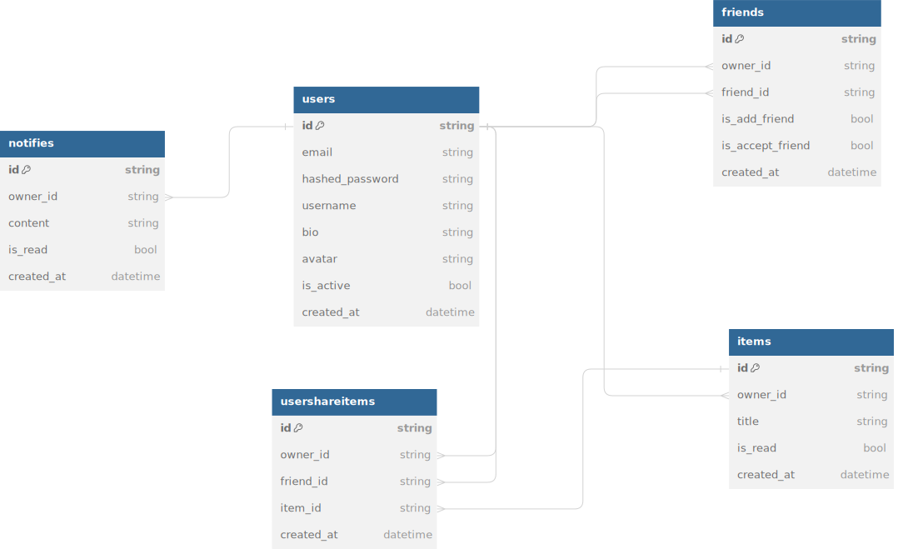

# ShareYourImage Project

## Overview

ShareYourImage is a platform for users to upload, share, and comment on images. This README provides an overview of the project's architecture, including the technologies used, the database structure, and instructions for setting up the development environment.

## Table of Contents

1. Technical Overview
   1.1. Frontend
   1.2. Backend
   1.3. Database
   1.4. Cloud
2. Database Structure
3. Installation and Setup

## Database structure

